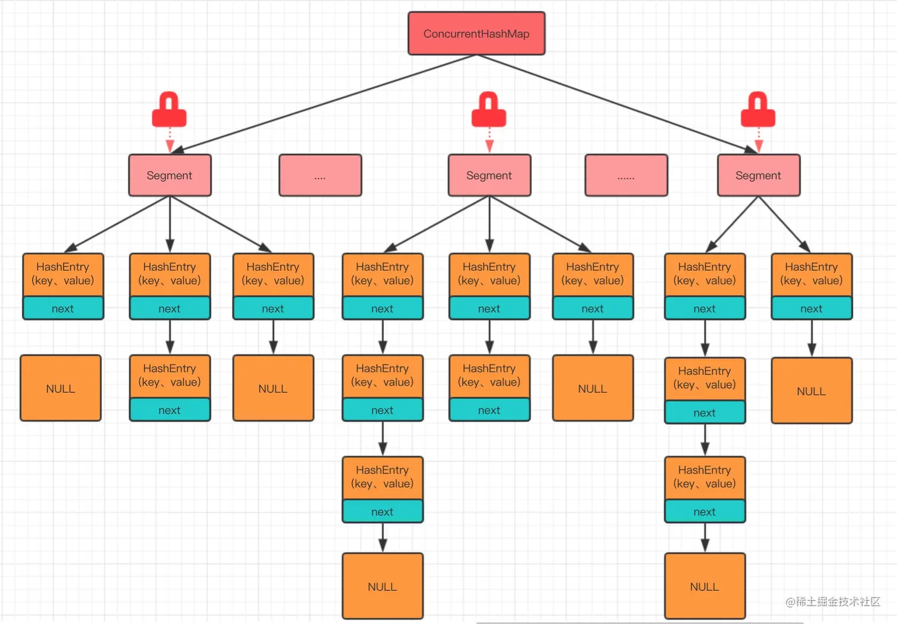

### 为什么HashMap的数组长度是2的次方？
因为HashMap底层使用了`hash & (length-1)`的方式来获取索引的位置。当长度是2的次方是，`length-1`则可以充当一个低位掩码的作用。同时在扩容后，也能够保证元素的位置要么是与原位置保持一致，要么就是元素组的长度加上原位置。

```text
hash = `1101`
if length == 4:
hash & (length - 1) == `1`== 1
if length == 8:
hash & (length - 1) == `101` == 5
```

### ConcurrentHashMap如何实现并发安全的？
在jdk1.7时使用分段的概念来实现并发安全。具体来说ConcurrentHashMap把每多个HashEntry放入到一个Segment中，然后对Segment加一个ReentrantLock锁。这里的Segment就与HasMap的概念差不多。Segment默认为16个。不同Segment间能实现写写并发，同一个Segment中能实现读写并发，但是同一个Segment中不能实现写写并发。这样虽然解决了并发安全问题，但是并发度低且不能扩展Segment的数量（一个Segment可以理解为一个并发度）。**jdk1.7解决哈希冲突的方法是使用“再哈希法”，并且jdk1.7的ConcurrentHashMap允许key为空而不允许value为空**。



而在jdk1.8中使用了CAS+synchronized关键字来解决并发安全问题。与HashMap一样链表也会在长度达到 8 的时候转化为红黑树，这样可以提升大量冲突时候的查询效率；以哈希槽的头结点（链表的头结点或红黑树的 root 结点）为锁，配合自旋 + CAS 避免不必要的锁开销，进一步提升并发性能。**jdk1.8的ConcurrentHashMap不允许key和value为空**。因为无法区分是获取的key为空还是获取失败为空。

具体`put`流程：
- 添加元素时首先会判断容器是否为空（在添加元素时才会初始化）
- 如果容器为空则依赖**volatile加CAS来初始化table**。
- 如果容器不为空，则利用** CAS 判断哈希槽的首节点是否为空**。
  - 如果首节点为空，则利用 **CAS 设置该节点**；插入成功就推出循环，否则等待下一轮循环。
  - 如果首节点不为空，并且节点的hash值为-1，则表示有线程正在扩容，那么当前线程就加入扩容队伍帮助扩容。使用**CAS和synchronied进行扩容**。
  - 如果不为空，也没有扩容。那么使用**synchronied插入元素，synchronied锁的是头节点**，防止多线程并发修改节点元素。

  ### ConcurrentHashMap的size方法是如何实现的？为什么会不准确？
  在java7中，ConcurrentHashMap实现size的方式是首先以无锁的方式遍历每一个segment，累加每一个segment的count，如果过程中的modCount没有发生变化则表示没有并发操作。如果modCount发生变化则会重试，最多重试2次。如果两次都失败则会对所有segment加锁进行累加。并发修改时，`size()` 返回的是一个近似值，而非实时精确值。这种设计牺牲了绝对准确性，但大幅提升了性能。

  在java8中，使用CAS和CounterCell数组来优化 `size()` 的计算。在 `size()` 方法实现过程中，使用baseCount变量记录未发生竞争时的元素数量。如果发生多个线程记录baseCount，则会通过CAS更新CounterCell数组中的某个元素，最终通过baseCount+sum(CounterCell[])得到总大小。如果直接使用一个全局的 volatile int size，每次修改都需要通过 CAS 更新该变量，会导致大量线程竞争，降低吞吐量。而 CounterCell 数组通过分散竞争（每个线程更新不同的槽位）减少了冲突。由于CounterCell数组可能在累加过程中被修改，最终结果是一个近似值（但在并发场景下足够实用）。