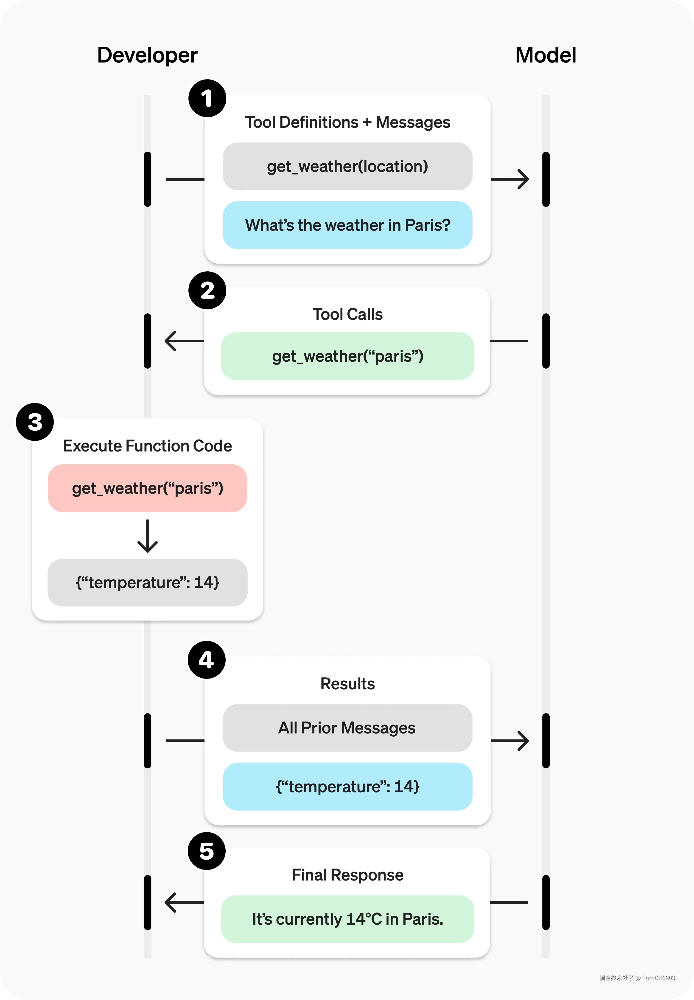
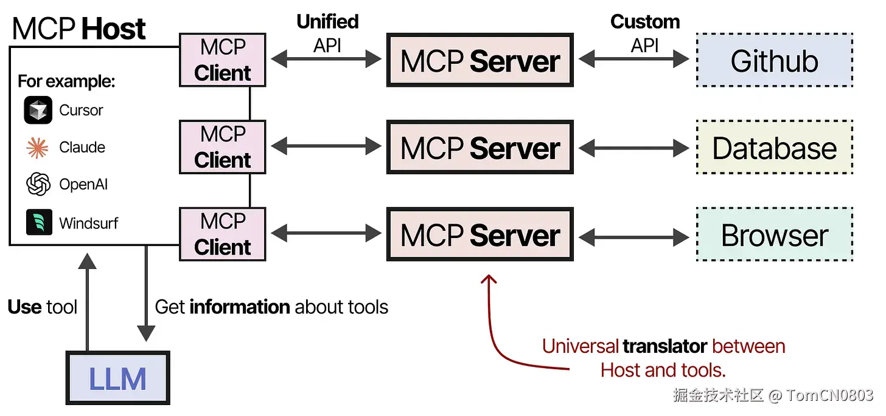

### 什么是Transformer？

### 了解Bert和GPT架构的区别吗？

Bert是基于 Transformer 的双向编码器表征模型，他的目标是理解句子中的单词和上下文的含义，使用大量文本语料进行无监督和监督学习进行训练。**Bert是一个Encoder-Only的模型。**Bert使用掩码语言模型（Masked Language Model，MLM）和下一句预测（Next Sentence Prediction，NSP）两个任务进行训练。MLM是为了让BERT模型能够理解词语的语义和上下文信息，而NSP则是为了让BERT学习到句子级别的语义和推理能力。由于BERT具有强大的上下文理解能力和双向模型的特点，它在各种下游任务中表现优秀，如文本分类、命名实体识别、语义关系判断等。

GPT是生成预训练 Transformer，他的目标是生成连贯且适当的上下文文本，与BERT一样使用的大量文本语料进行训练。**GPT是一个Decoder-Only的模型。**GPT采用了**自回归语言模型**的预训练方式，通过自回归的方式逐步生成下一个词语。模型根据已生成的上文预测下一个词语，通过最大似然估计来优化模型参数。GPT主要用于生成式任务，如对话生成、文本生成和机器翻译等。它能够生成自然流畅的文本，但在一些需要输入-输出对齐的任务中效果较弱。

### Dense与MoE有什么区别？

### MCP和function calling的区别？

MCP和Funtion calling是为了让LLM与外部系统进行交互的两种关键技术概念。

Function calling会把用户的自然语言与已有的函数的描述作为输入参数传给大模型，大模型结合输入参数决定调用哪个函数，并指明必要参数然后进行格式化输出。用户端接收到格式化输出的函数调用后进行本地函数的调用得到结果，然后返回给大模型。

MCP提供了一个统一的协议框架调用外部系统执行function calling。MCP把系统函数独立成一个MCP server服务，MCP client根据用户输入和服务中的函数描述选择调用MCP server服务中的功能函数。MCP统一的是MCP client和MCP server之间的协议。至于各个MCP Host和MCP client之间是否一致没有强制要求。

