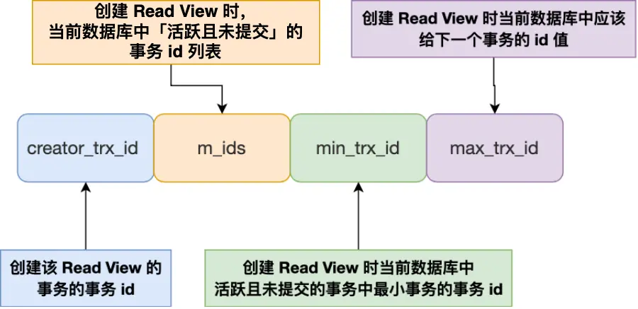

### 什么是事务？事务有哪些特性？
事务是一条或者多条SQL语句组成的执行单元。事务有四个特性：原子性、一致性、隔离性和持久性。
- 原子性：原子性意味着事务中的所有操作**要么全部完成，要么全部不完成**，它是不可分割的单位。对于一个事务中的操作不能只执行其中一部分。
- 一致性：一致性确保事务从一个一致的状态转换到另一个一致的状态。一致性与业务规则有关，比如银行转账，不论事务成功还是失败，转账双方的总金额应该是不变的。
- 隔离性：隔离性意味着并发执行的**事务是彼此隔离的**，一个事务的执行不会被其他事务干扰。事务之间是井水不犯河水的。
- 持久性：持久性确保事务一旦提交，它对数据所做的更改就是永久性的，即使系统发生崩溃，数据也能恢复到最近一次提交的状态。

MySQL事务的原子性主要通过 Undo Log 来实现，持久性通过 Redo Log 来实现，隔离性由 MVCC 和锁机制来实现，一致性则由其他三大特性共同保证。

### 事务的隔离级别有哪些？
隔离级别定义了一个事务可能受其他事务影响的程度，MySQL 支持四种隔离级别，分别是：读未提交、读已提交、可重复读和串行化。

读未提交会出现脏读，读已提交会出现不可重复读，可重复读是 InnoDB 默认的隔离级别，可以避免脏读和不可重复读，但会出现幻读。**但是MySQL实现的可重复读的隔离级别可以通过 MVCC 和临键锁解决幻度问题和防止大多数并发问题**。尽量在开启事务之后，马上执行 `select ... for update` 这类锁定读的语句。
- 脏读：如果一个事务「读到」了另一个「未提交事务修改过的数据」，就意味着发生了「脏读」现象。
- 不可重复读：在一个事务内多次读取同一个数据，如果出现前后两次读到的数据不一样的情况，就意味着发生了「不可重复读」现象。
- 幻读：假设事务A和事务B都执行的是插入语句`insert into table(idx,name,age) values(6,"vinta",18)`。事务A中先通过查询语句查询`idx=6`的数据是否存在，查询结束后发现不存在。开始执行插入操作，而此时事务B比A先执行完成查询操作并已经执行了插入操作，然后事务A则没办法插入，只能执行update操作。这种情况对于事务A来说就是幻读。同样的，在一个事务内多次查询某个符合查询条件的「记录数量」，如果出现前后两次查询到的记录数量不一样的情况，就意味着发生了「幻读」现象。

### 分布式事务了解吗？

分布式事务主要有强一致性和最终一致性两种实现方案。强一致性的代表是2PC和3PC，他们是XA协议的具体实现。最终一致性的代表是TCC、Saga、本地消息表和消息队列等实现方式。

- 2PC：2PC是两阶段提交，第一阶段为TM (transaction manager) 发送执行事务的请求,RM (resource manager) 执行具体事务并返回。第二阶段为TM向RM发送提交/回滚事务请求，RM提交/回滚事务并返回。这种方式可能会因为某一个事务执行时间较长或者因为某一个事务RM宕机没办法执行事务而占用长期资源。**所以只适用于对一致性要求较高且能接受一定阻塞的场景，比如金融支付场景。**
- 3PC：3PC是为了解决RM宕机导致无法执行事务的问题。第一阶段是TM询问RM是否可以执行提交事务，RM返回响应。第二阶段是TM向RM发送执行事务请求，RM执行具体的事务但不提交。第三阶段则是TM向RM发送提交事务请求，RM相应请求。虽然避免了RM可能宕机的问题，但还是没有解决某个事务执行时间较长而导致长时间阻塞的问题。同时还因为第一阶段的询问增加了额外的网络请求，因为RM宕机的概率相当低。
- TCC：TCC是Try-Confirm-Cancel。这种方式对代码的入侵较强，需要业务实现TCC接口。Try阶段执行预留资源，比如创建订单将状态改为待支付。Confirm阶段则确认资源完成业务操作，比如将支付状态改为已支付。Cancel阶段是失败的时候对资源进行回滚操作。
- Saga：Saga则是将长事务拆分为多个短事务，每个事务都有相应的事务补偿，如果有事务失败则对已经执行的事务反向执行操作，没有执行的事务则不需要回滚。
- 本地消息表：本地消息方式分为两个阶段，第一阶段执行事务并将生成消息存储到本地消息表（数据库）中，标记为待发送。第二阶段是通过定时任务扫描数据库中消息，然后通过MQ通知下游服务，下游服务消费成功后确认消息，失败则重试。多次失败可以发送到消息队列人工处理。
- 消息队列：与本地消息方式相似，第一阶段执行事务并将消息发送到消息队列。第二阶段是其他事务消费消息队列中的消息并执行事务，下游服务消费成功后确认消息，失败则重试。多次失败可以发送到消息队列人工处理。

### 了解MVCC吗？
MVCC是多版本并发控制(multi-version-concurrent-control)，每次修改数据时都会生成一个数据版本，而不是在直接在原来的数据上修改。并且每个事务只能看到在它开始之前已经提交的数据版本。MVCC通主要依赖与undolog和Read View实现。

对于「读提交」和「可重复读」隔离级别的事务来说，它们是通过 Read View 来实现的，它们的区别在于创建 Read View 的时机不同。Read View可以理解为是数据快照。
- 修改数据前，会先将记录拷贝到Undo Log，并且每条记录会包含三个隐藏列，DB_TRX_ID 用来记录修改该行的事务 ID，DB_ROLL_PTR 用来指向 Undo Log 中的前一个版本，DB_ROW_ID 用来唯一标识该行数据（仅无主键时生成）。
- 读取数据时，都会生成一个 ReadView，其中记录了当前活跃事务的 ID 集合、最小事务 ID、最大事务 ID 等信息，通过与 DB_TRX_ID 进行对比，判断当前事务是否可以看到该数据版本。

Read View 有四个重要的字段：

1. 如果某个数据版本的 DB_TRX_ID 小于 min_trx_id，则该数据版本在生成 ReadView 之前就已经提交，因此对当前事务是可见的(当前事务ID>=min_trx_id)。

2. 如果 DB_TRX_ID 大于 max_trx_id，则表示创建该数据版本的事务在生成 ReadView 之后开始，因此对当前事务不可见(当前事务ID<=max_trx_id)。

3. 如果 DB_TRX_ID 在 min_trx_id 和 max_trx_id 之间，需要判断 DB_TRX_ID 是否在 m_ids 列表中：
- 不在，表示创建该数据版本的事务在生成 ReadView 之后已经提交，因此对当前事务也是可见的。
- 在，表示事务仍然活跃，或者在当前事务生成 ReadView 之后才开始，因此是不可见的。

ReadView判断记录的某个版本对当前事务是否可见的依据其实就是「如果某个版本的事务已经提交，那么对于当前事务则可见」。只不过是生成一次（可重复读）还是生成多次（读已提交）的问题。

### 什么是当前读和快照读？
当前读是锁定读，不会产生一个快照数据。InnoDB在实现Repeatable Read时，如果执行的是当前读，则会对读取的记录使用Next-key Lock，来防止其它事务在间隙间插入数据。这样能够解决Repeatable Read的幻读问题。当前读有以下几种情况。
- `select ... lock in share mode`：对记录加共享锁，其它事务也可以加共享锁，如果加排他锁则会被阻塞；
- `select ... for update`：对记录加排他锁，且其它事务不能加任何锁；
- `insert`、`update`、`delete` 操作：对记录加排他锁，且其它事务不能加任何锁；

快照读取是基于事务开始时数据库中的状态创建的，因此事务不会读取其他事务尚未提交的修改。当一个事务执行读操作时，它会使用快照读取。

两个事务同时修改同一行数据时：
- 事务 A 先获取行锁并修改数据
- 事务 B 尝试修改时会被阻塞，等待事务 A 释放锁
- 事务 A 提交或回滚后释放锁，事务 B 才能继续执行

### MySQL数据库有哪些锁
- 全局锁：**全局锁住要用于全表备份**。通过`flush tables with read lock`语句可以锁定整个数据库，此时数据库会进入只读状态。如果执行写操作则会被阻塞。这样在备份数据库期间不会因为数据库表结构的更新导致备份文件的数据与预期的不一致。
- 表级锁：
  - 表锁：使用`lock tables`对整个表加锁，表锁除了限制其他线程读写外还是限制本线程的读写操作。
  - 元数据锁：**MDL是为了保证当用户对表执行CURD操作时防止其他线程对表结构做变更**。当我们对数据库表进行操作时，会自动给这个表加上DML，对表进行CURD操作时会加上MDL读锁；对表结构做变更操作时加的是MDL写锁。
  - 意向锁：**意向锁的目的是为了快速判断表里是否有记录被加锁**。当执行插入、更新、删除操作，需要先对表加上「意向独占锁」，然后对该记录加独占锁。
- 行级锁：InnoDB 引擎是支持行级锁的，而 MyISAM 引擎并不支持行级锁。
  - 记录锁：锁住的是一条记录。而且记录锁是有 S 锁和 X 锁之分的，满足读写互斥，写写互斥
  - 间隙锁：只存在于可重复读隔离级别，目的是为了解决可重复读隔离级别下幻读的现象。
  - 临键锁：是 Record Lock + Gap Lock 的组合，锁定一个范围，并且锁定记录本身。

