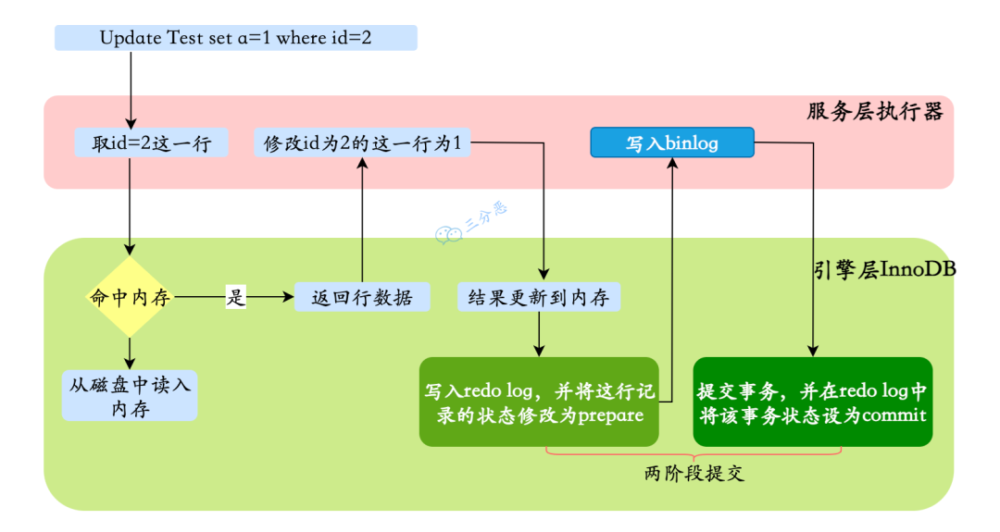
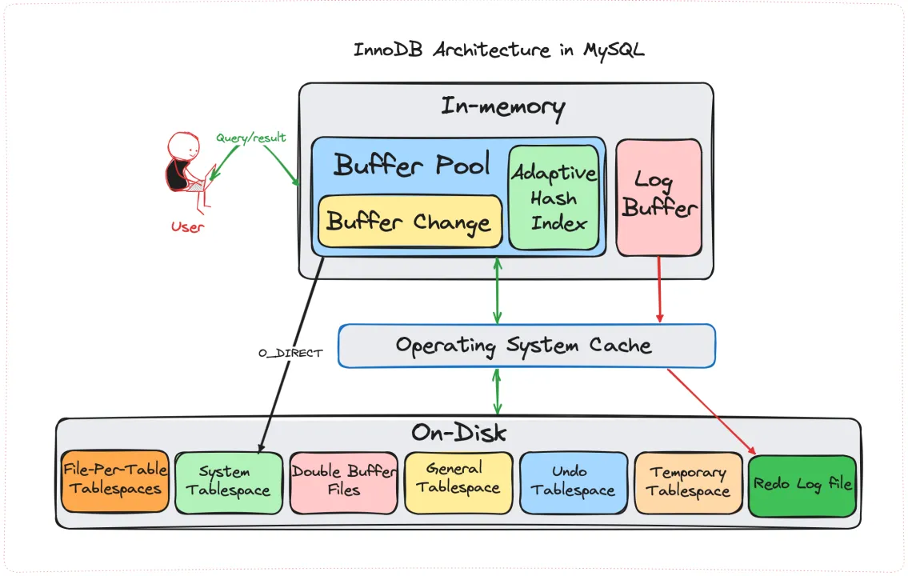
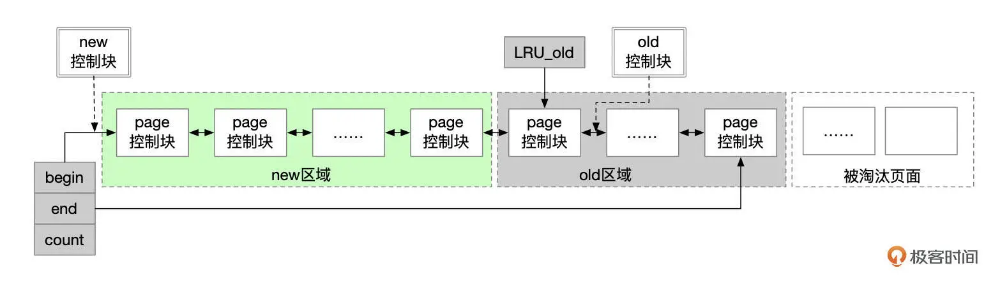
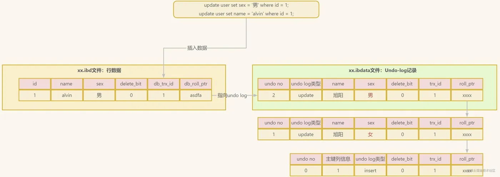
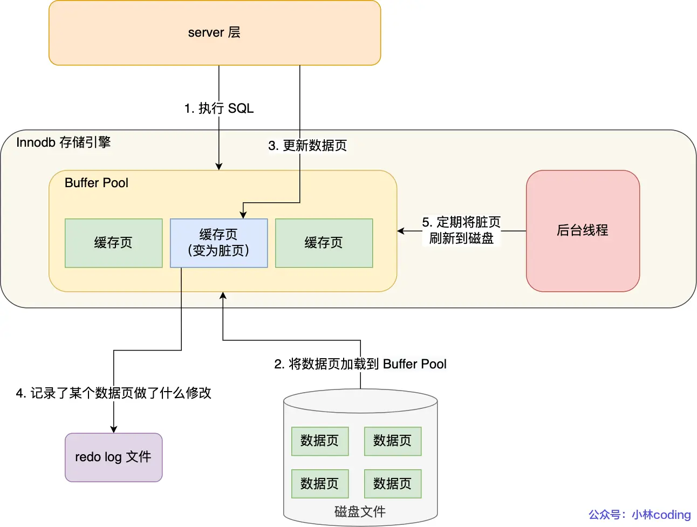

## 数据库架构
### 说一下MySQL的数据库架构

### 一条查询SQL请求的执行过程是什么？

- 客户端向MySQL服务器发送SQL查询语句
- **连接器**处理这个请求：与客户端**建立连接、获取权限、管理连接**.
- **服务层**根据SQL语句查询缓存，如果缓存命中则直接返回（MySQL 8.0 已经删除）。
- **解析器**对SQL语句进行解析：对SQL进行词法分析（拆SQL，识别关键字和表名、列名）、语法分析（检查语法规范，并构建抽象语法树）。
- **优化器**确定SQL语句的执行计划，包括语义分析（检查表和列是否存在），选择使用哪些索引，以及决定表之间的连接顺序等。
- **执行器**调用存储引擎的API来读取数据。
- **引擎层**执行SQL语句获取数据并返回给服务层。如果是InnoDB引擎，先在缓冲池中获取数据，如果没有则在硬盘中加载数据页到缓冲池，然后返回符合条件的记录给服务层。
- **服务层**将结果返回给客户端。

### 一条更新SQL请求的执行过程是什么？

总的来说，一条 UPDATE 语句的执行过程包括读取数据页、加锁解锁、事务提交、日志记录等多个步骤。

- 服务层**执行器开启事务**并从引擎层获取数据。引擎层首先从内存中获取数据，如果内存中没有则从硬盘加载**数据页**到内存中。然后返回符合条件的行记录（数据）到服务层。**引擎层在读取数据时会加锁**。
- 服务层计算新值后调用引擎层更新接口，引擎层在Buffer Pool中更新行记录（数据），然后记录undolog并将数据页标记为脏页，记录redolog（以缓存的形式存在）并标记为 prepare 状态并通知服务层。
- **服务层将更新记录写入到 binlog 中**，然后通知引擎层。
- **引擎层将redolog标记为`commit`状态**。刷盘之前，redolog以缓存的形式存在。
- **服务层将事务状态更新为已提交**。引擎层清理事务相关资源、释放锁。
- 后台线程根据`innodb_flush_log_at_trx_commit`配置将redolog刷盘然后将脏页刷盘。根据WAL（日志先行）原则，日志比数据先一步刷入磁盘，这样能保证事务安全。
  
所以在更新过程中，服务层的作用是开启和关闭事务，获取并更新数据、记录binlog。而引擎层则需要管理事务相关的资源，更新数据，记录脏页、undolog和redolog。此外，**虽然服务层管理事务的开启和关闭，但实际上真正控制事务的开启与关闭是引擎层的功能**。比如设置为MyISAM引擎时，服务层开启的事务只是一种语法支持，不具备真正事务的支持。

### MySQL中的缓存

MySQL中的缓存是指MySQL的内存中的缓存，包括内存表缓存、内存索引缓存和内存查询缓存等。这些缓存可以加快MySQL的查询性能，但也会占用内存资源。

| 缓存类型         | 层级  | 作用                                 | 配置参数                               |
|--------------|-----|------------------------------------|------------------------------------|
| 查询缓存         | 服务层 | 缓存SQL执行结果集                         | `query_cache_size`（MySQL 5.7-版本存在） |
| 表缓存          | 服务层 | 存储表结构数据                            | 无                                  |
| 排序缓存         | 服务层 | 优化排序操作                             | `sort_buffer_size`                 |
| 键缓存(MyISAM)  | 引擎层 | 缓存 MyISAM 表的索引数据，加速索引查找            | `key_buffer_size`                  |
| 缓冲池(InnoDB)  | 引擎层 | 缓存数据页和索引页，实现 “预读” 和 “写缓冲”，大幅减少磁盘访问 | `innodb_buffer_pool_size`          |
| 日志缓冲(InnoDB) | 引擎层 | 缓存 InnoDB 的 redo 日志，减少日志写入磁盘的频率    | `innodb_log_buffer_size`           |

## 数据库执行引擎
### MySQL的引擎有哪些？有了解过吗？

- InnoDB: InnoDB是MySQL**默认引擎**，支持**ACID事务**、**行级锁**、**外键约束**
  等功能。InnoDB引擎具有很好的高并发读写性能，支持较好的数据完整性和并发控制，适用于高并发的读写操作。InnoDB还利用redolog实现了崩溃恢复的功能。
- MyISAM: MyISAM是MySQL另一种常见的引擎，具有**较低的存储空间和内存消耗**
  ，适用于大量的读操作。但是由于MyISAM不支持事务、行级锁、外键约束，在数据完整性的支持和并发写操作性能方面有一定限制。
- Memory: Memory把数据存储在内存中，适用于对性能要求较高的读操作场景。但是如果服务器宕机或关机则会导致数据丢失。另外，MyISAM也不支持事务、行级锁和外键约束。

### 为什么InnoDB是MySQL的默认引擎？

- 事务支持：InnoDB提供了事务支持，可以实现事务的ACID（原子性、一致性、隔离性、持久性）操作。其他引擎是不支持事务的。
- 并发性能：InnoDB实现了行级锁，可以提供更好的并发性能。MyISAM只支持表级锁，锁粒度太大。
- 崩溃恢复：InnoDB通过redolog日志实现了崩溃恢复，可以在数据库发生异常情况时，通过日志文件进行数据恢复，保证了数据的持久性和一致性。其他引擎是不支持的。

### InnoDB和MyISAM引擎有什么区别？

| 引擎     | 事务    | 索引                           | 外键    | 崩溃恢复能力          |
|--------|-------|------------------------------|-------|-----------------|
| InnoDB | 支持事务  | 支持全文索引、B+树索引、哈希索引 索引结构为聚簇索引 | 支持外键  | 通过redolog支持崩溃恢复 |
| MyISAM | 不支持事务 | 支持全文索引、B+树索引                 | 不支持外键 | 没有崩溃恢复能力        |
| MEMORY | 不支持事务 | 支持B+树索引和哈希索引                 | 不支持外键 | 没有崩溃恢复能力        |

### 谈一下对InnoDB的Buffer pool的了解

Buffer pool是InnoDB引擎的一个内存缓冲区，它会将查询到的数据页和索引页加载到内存中，读的时候先读取Buffer pool中的数据，如果命中就不用访问硬盘。

如果没有命中，就从磁盘读取，并加载到 Buffer Pool，此时可能会触发页淘汰，将不常用的页移出 Buffer Pool。

写操作时不会直接写入磁盘，而是先修改内存中的页，此时页被标记为脏页，后台线程会定期将脏页刷新到磁盘。Buffer Pool 可以显著减少磁盘的读写次数，从而提升 MySQL 的读写性能。


InnoDB对LRU进行了改良，最近访问的数据不会放到LUR链表头部，而是放到midpoint的位置。一般情况下midpoint在LRU链表的5/8处。只有当数据被频繁访问时才会移动到young区。这样做的好处是热点页能长时间保留在内存中，不容易被挤出去。

默认情况下，LRU 链表中 old 区占 37%；同一页再次访问提升的最小时间间隔是 1000 毫秒。
也就是说，**如果某页在 1 秒内被多次访问，只会计算一次，不会立刻升级为热点页**，防止短时间批量访问导致缓存污染。

## MySQL日志文件
### MySQL的日志文件有哪些？
有 6 大类，其中**错误日志**用于问题诊断，**慢查询日志**用于 SQL 性能分析，**general log** 用于记录所有的 SQL 语句，**binlog** 用于主从复制和数据恢复，**redo log** 用于保证事务持久性，**undo log** 用于事务回滚和 MVCC。

①、错误日志（Error Log）：记录 MySQL 服务器启动、运行或停止时出现的问题。

②、慢查询日志（Slow Query Log）：记录执行时间超过 long_query_time 值的所有 SQL 语句。这个时间值是可配置的，默认情况下，慢查询日志功能是关闭的。

③、一般查询日志（General Query Log）：记录 MySQL 服务器的启动关闭信息，客户端的连接信息，以及更新、查询的 SQL 语句等。

④、二进制日志（Binary Log）：**记录所有修改数据库状态的 SQL 语句，以及每个语句的执行时间**，如 INSERT、UPDATE、DELETE 等，但不包括 SELECT 和 SHOW 这类的操作。

⑤、重做日志（Redo Log）：记录对于 InnoDB 表的每个写操作，不是 SQL 级别的，而是物理级别的，主要用于崩溃恢复。

⑥、回滚日志（Undo Log，或者叫事务日志）：记录数据被修改前的值，用于事务的回滚。

### 详细说一下binlog
#### binlog作用
binlog 日志是MySQL服务层记录所有修改表结构操作的日志。比如update、delete等。binlog 采用追加写的方式记录，当日志文件达到阈值（可在my.conf中配置）后会创建一个新的文件继续写，不会覆盖以前的日志，保存的是全量的日志。所以binlog可以用与主从复制和备份恢复。
#### binlog三种模式
binlog有三种格式模式，分别为STATEMENT、ROW和MIXED。

STATEMENT模式记录的是逻辑操作，每一条修改数据的SQL都会被记录到binlog中。但是STATEMENT模式有一个动态函数的问题，比如使用了UUID和NOW等函数。如果从库读取到这些SQL后执行，就会导致主从数据不一致。

ROW模式记录的是修改的最终结果，row模式记录的内容看不到详细信息，要通过mysqlbinlog工具解析出来。ROW格式没有STATEMENT格式下的动态函数问题，但是ROW格式会占用更多的空间资源。比如在批量操作时，会把全部的修改都记录到binlog中。

MIXED模式包含了STATEMENT格式和ROW格式。MIXED模式下会根据不同情况自动使用ROW格式和STATEMENT格式。

statement格式与row格式的区别
```sql
-- statement格式（只记录一条SQL）
UPDATE users SET salary = salary * 1.1 WHERE department = 'IT';

--row格式(每一行都要记录)
UPDATE users WHERE id=1001 SET salary=5500 --(原值5000)
UPDATE users WHERE id=1002 SET salary=6600 --(原值6000)
UPDATE users WHERE id=1003 SET salary=7700 --(原值7000)
```
#### binlog主要特点
- 所在位置：服务层
- 记录内容：修改表结构的全部语句（数据操作：insert、update、delete，表操作：create、alter、drop等其他增删改操作）
- 主要作用：主从备份、数据恢复
- 格式类型：STATEMENT、ROW、MIXED

### 说一下对undolog的理解？
#### undolog的作用
undolog是InnoDB引擎层的日志文件，是一种撤回日志，用于**保障mysql事务的原子性（atomicity）**。在事务开始之后，undolog会把更新之前的**数据信息**写入undolog日志文件中。当事务回滚时，可以利于undolog回滚操作。

对于InnoDB引擎来说，每个行记录除了记录本身的数据之外，还有几个隐藏的列：
- DB_ROW_ID：如果没有为表显式的定义主键，并且表中也没有定义唯一索引，那么InnoDB会自动为表添加一个row_id的隐藏列作为主键。
- DB_TRX_ID：每个事务都会分配一个事务ID,当对某条记录发生变更时，就会将这个事务的事务ID写入tx_id中。
- DB_ROLL_PTR: 回滚指针，本质上就是指向undolog的指针。
#### undolog的两种类型
undolog有两种格式：insert类型和update类型。

插入的数据都会生成一条insert undolog，并且数据的回滚指针会指向它。undolog会记录undolog的序号、插入主键的列和值...，那么在进行rollback的时候，通过主键直接把对应的数据删除即可。因为insert操作的记录，只对事务本身可见，对其他事务不可见（这是事务隔离性的要求），故该undolog可以在事务提交后直接删除，不需要进行purge操作。

更新一条数据时，会把老的记录写入新的undolog，让（被更新的行记录）回滚指针指向新的undolog，它的undo no是1，并且新的undolog会指向老的undolog（undo no=0），最终形成undolog版本链，如下图所示：

更新操作的undolog可能需要提供MVCC机制，因此不能在事务提交时就进行删除。提交时放入undolog链表**等待purge线程进行最后的删除**。（Purge线程是MySQL数据库中的一种后台线程，负责清理数据库中的垃圾记录。如果Purge线程没有正确地清理垃圾记录，那么可能会出现Purge死锁问题。）

#### undolog主要特点
- 所在位置：引擎层
- 记录内容：更新之前的记录、rowID、事务ID、回滚指针等
- 主要作用：保证事务的原子性
- 格式类型：insert类型和update类型

### 说一下对redolog的理解
#### redolog的作用
redolog是引擎层的物理日志，用于保证事务的持久型，redolog记录了某个数据页修改了什么内容，例如“将 page_id=123 上 offset=0x40 的数据从 18 修改为 26”。每执行一个事务，都会产生这样一条或多条物理日志。在事务提交时，先将redolog持久化到磁盘，然后buffer pool中的脏页才会被持久化到磁盘中。如果系统崩溃时，脏页没来得及持久化，但是redolog已经持久化，那么mysql重启后可以根据redolog的内容进行恢复。从而保证了事务的持久性。
#### redolog如何实现持久性的？
InnoDB使用Buffer Pool缓存加速引擎的数据存取。在第一次读取时把数据页放入到buffer pool中，并返回符合条件的行记录。在写入时也是优先写入到buffer pool中。但由于缓存是基于内存的，内存总是不可靠的。如果发生断电重启则会导致没有及时刷盘的脏页数据丢失。所以InnoDB采用WAL（Write-Ahead Logging）技术，即「先刷日志，再刷脏页」的方式来保证事务的持久性。在事务提交时，先将redolog日志持久化到磁盘，然后脏页数据由后台线程取持久化。这样即使服务器断电重启也能够根据redolog和binlog找到对应的内容将数据恢复到最新状态。

