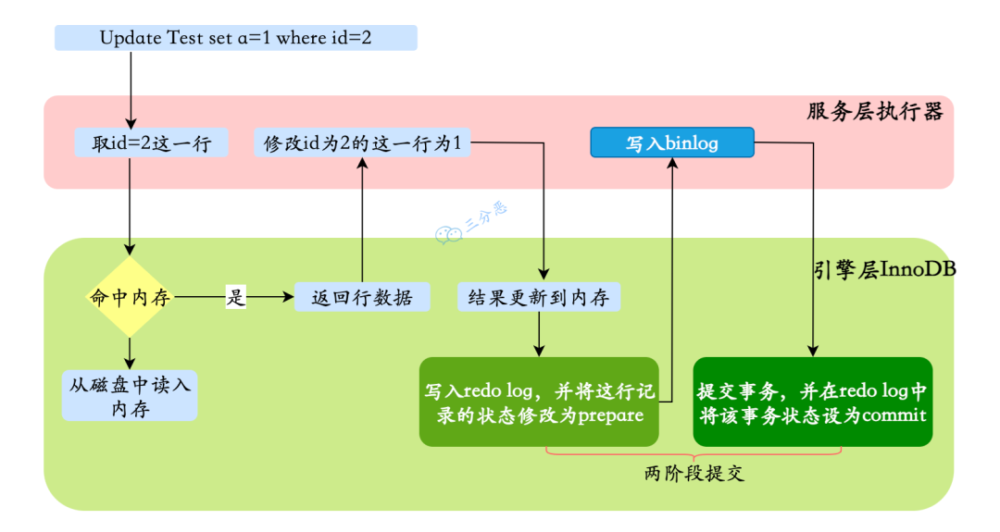

### MySQL中的缓存

MySQL中的缓存是指MySQL的内存中的缓存，包括内存表缓存、内存索引缓存和内存查询缓存等。这些缓存可以加快MySQL的查询性能，但也会占用内存资源。

| 缓存类型         | 层级  | 作用                                 | 配置参数                             |
|--------------|-----|------------------------------------|----------------------------------|
| 查询缓存         | 服务层 | 缓存SQL执行结果集                         | `query_cache_size`（MySQL 5.7-版本存在） |
| 表缓存          | 服务层 | 存储表结构数据                            | 无                                |
| 排序缓存         | 服务层 | 优化排序操作                             | `sort_buffer_size`                 |
| 键缓存(MyISAM)  | 引擎层 | 缓存 MyISAM 表的索引数据，加速索引查找            | `key_buffer_size`                  |
| 缓冲池(InnoDB)  | 引擎层 | 缓存数据页和索引页，实现 “预读” 和 “写缓冲”，大幅减少磁盘访问 | `innodb_buffer_pool_size`          |
| 日志缓冲(InnoDB) | 引擎层 | 缓存 InnoDB 的 redo 日志，减少日志写入磁盘的频率    | `innodb_log_buffer_size`           |

### MySQL存取过程中的缓存

- 读取数据时，先检查缓冲池，命中则直接返回；未命中则从磁盘加载到缓冲池。
- 写入数据时，先更新缓冲池中的页（脏页），再异步刷新到磁盘（通过`innodb_flush_log_at_trx_commit`控制刷盘策略）。

### 一条查询SQL请求的执行过程是什么？
- 客户端向MySQL服务器发送SQL查询语句
- **连接器**处理这个请求：与客户端**建立连接、获取权限、管理连接**.
- **服务层**根据SQL语句查询缓存，如果缓存命中则直接返回（MySQL 8.0 已经删除）。
- **解析器**对SQL语句进行解析：对SQL进行词法分析（拆SQL，识别关键字和表名、列名）、语法分析（检查语法规范，并构建抽象语法树）。
- **优化器**确定SQL语句的执行计划，包括语义分析（检查表和列是否存在），选择使用哪些索引，以及决定表之间的连接顺序等。
- **执行器**调用存储引擎的API来读取数据。
- **引擎层**执行SQL语句获取数据并返回给服务层。如果是InnoDB引擎，先在缓冲池中获取数据，如果没有则在硬盘中加载数据页到缓冲池，然后返回符合条件的记录给服务层。
- **服务层**将结果返回给客户端。

### 一条更新SQL请求的执行过程是什么？
总的来说，一条 UPDATE 语句的执行过程包括读取数据页、加锁解锁、事务提交、日志记录等多个步骤。
- 服务层执行器开启事务并从引擎层获取数据。引擎层首先从内存中获取数据，如果内存中没有则从硬盘加载**数据页**到内存中。然后返回符合条件的行记录（数据）到服务层。引擎层在**读取数据时**会加锁。
- 服务层计算新值后调用引擎层更新接口，引擎层在Buffer Pool中更新行记录（数据），然后记录undolog并将数据页标记为脏页，记录 redolog（以缓存的形式存在）并标记为 prepare 状态并通知服务层。
- 服务层将更新记录写入到 binlog 中，然后通知引擎层。
- 引擎层将redolog标记为`commit`状态。刷盘之前，redolog以缓存的形式存在。
- 服务层将事务状态更新为已提交。引擎层清理事务相关资源、释放锁。
- 后台线程将脏页刷盘、根据`innodb_flush_log_at_trx_commit`配置将redolog刷盘。

所以在更新过程中，服务层的作用是开启和关闭事务，获取并更新数据、记录binlog。而引擎层则需要管理事务相关的资源，更新数据，记录脏页、undolog和redolog。