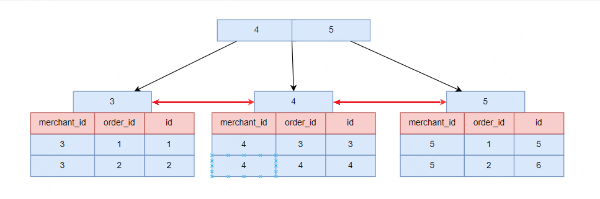

### 索引分类
索引可以按照不同的维度进行划分。
- 数据结构纬度：B+树索引、Hash索引、Full-Text索引
- 物理存储纬度：聚簇索引（主键索引）、二级索引（辅助索引）
- 字段特性纬度：主键索引、唯一索引、普通索引、前缀索引
- 字段个数纬度：单列索引、联合索引（复合索引）

### 主键索引与唯一索引的区别？
- 主键索引是一种聚簇索引，叶子节点保存的是主键和数据内容。主键要求内容不能为空，并且具有唯一性。可以说是唯一索引的子集。
- 唯一索引要求列的内容唯一，但是可以为空。唯一索引不一定是聚簇索引，也可能是非聚簇索引。例如以用户名为唯一索引时，如果用户名不能为null则该索引为聚簇索引，如果可以为null则该索引为非聚簇索引。

### 介绍一下聚簇索引与非聚簇索引的区别
- 聚簇索引的叶子节点存放的是主键和数据。如果表没有设置主键，那么引擎会自动生成一个隐藏自增id为主键作为叶子节点的键。一个表只能有一个聚簇索引。
- 非聚簇索引存放的则是索引和主键。比如联合索引和普通索引等。由于只存放了主键，所以在查询时可能会发生回表操作。**根据非聚簇索引查到的主键值到聚簇索引中去查询对应的数据，这个过程就是回表**。

### 什么是联合索引？
联合索引是将多个列组合在一起作为一个索引。联合索引的的节点中存储的是**索引和主键**。所以在查询时可能会发生回表的情况，但是如果查询的内容是联合索引中的列，那么可以不用回表。这种情况称为覆盖索引。在使用联合索引时，需要遵循**最左匹配原则（或最左前缀原则）**，也就是按照最左优先的方式进行索引匹配。如果不按照最左匹配原则使用联合索引会导致联合索引失效。

比如创建了一个联合索引(a,b,c)。如果严格按照a,b,c的顺序查询则不会导致索引失效。具体可以分为下面几种情况。
- `where a = 1`: 走索引。
- `where a = 1 and b = 2`: 走索引。
- `where a = 1 and b = 2 and  c= 3`: 走索引。
- `where b = 1 and c = 3 and a = 3`: 走索引，因为优化器的作用。
- `where b = 1 and a = 2 and c = 3`: 走索引，因为优化器的作用。
- `where a = 1 and b = 2 and c > 3`: 走索引。
- `where a = 1 and b > 2 and c = 3`: c索引失效。

所以如果是在全部等值查询时，可以不用遵循最左前缀原则，因为优化器会自动优化。但是如果跳过最左匹配中的部分列则会导致索引失效。这是因为联合索引的数据存储结构导致的。

从图中可以看到，联合索引先保证了第一个列的顺序，在此基础上保证了第二个列的顺序性。所以如果要使用索引，就一定要保证索引的顺序性。如果无法保证顺序性就会走全表查询。当然也会发生部分索引生效的情况，比如上面的最后一个例子。同样的，查询条件为`where a=1 and c=3`时也会发生c索引失效的情况，因为索引先按a排序,在a相同的情况再按b排序,在b相同的情况再按c排序。所以,b和c是全局无序,局部相对有序的,这样在没有遵循最左匹配原则的情况下,是无法利用到索引的。

在使用联合索引时，还会发生索引下推的情况。**索引下推就是指在存储引擎层提前过滤掉不符合条件的记录，从而减少回表的次数**。假设现在还是联合索引(a,b,c)，并且查询条件为`where a = 1 and b = 2 and c < 4`，那么只有满足条件的部分才会回表，而`c>=4`的部分不会回表。

这个情况在模糊查询时也会发生。例如有一张 user 表，建了一个联合索引（name, age），查询语句：`select * from user where name like '张%' and age=10;`，没有索引下推优化的情况下：
MySQL 会使用索引 name 找到所有 name like '张%' 的主键，根据这些主键，一条条回表查询整行数据，并在 Server 层过滤掉不符合 age=10 的数据行。启用索引下推后，InnoDB 会通过联合索引直接筛选出符合条件的主键 ID（name like '张%' and age=10），然后再回表查询整行数据。

### 什么字段适合当做主键？
- 字段具有唯一性，且不能为空的特性。
- 字段最好的是有递增的趋势的，如果字段的值是随机无序的，可能会引发页分裂的问题，造型性能影响。
- 不建议用业务数据作为主键，比如会员卡号、订单号、学生号之类的，因为我们无法预测未来会不会因为业务需要，而出现业务字段重复或者重用的情况。
- 通常情况下会用自增字段来做主键，对于单机系统来说是没问题的。但是，如果有多台服务器，各自都可以录入数据，那就不一定适用了。因为如果每台机器各自产生的数据需要合并，就可能会出现主键重复的问题，这时候就需要考虑分布式id的方案了。