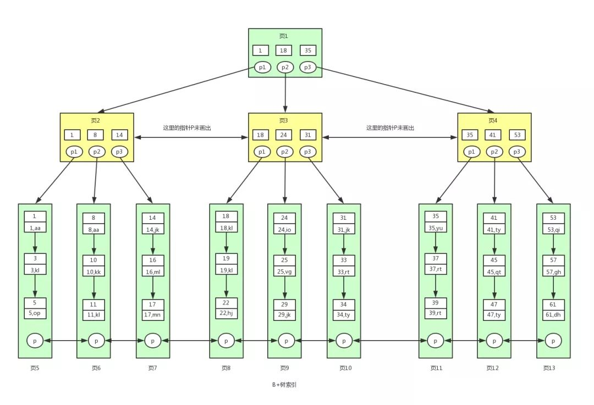
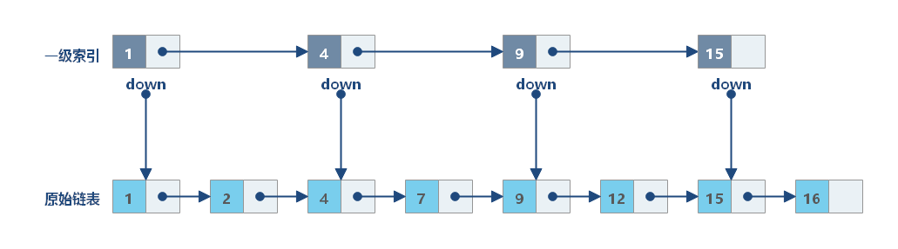

### 索引分类
索引可以按照不同的维度进行划分。
- 数据结构纬度：B+树索引、Hash索引、Full-Text索引
- 物理存储纬度：聚簇索引（主键索引）、二级索引（辅助索引）
- 字段特性纬度：主键索引、唯一索引、普通索引、前缀索引
- 字段个数纬度：单列索引、联合索引（复合索引）

### 主键索引与唯一索引的区别？
- 主键索引是一种聚簇索引，叶子节点保存的是主键和数据内容。主键要求内容不能为空，并且具有唯一性。可以说是唯一索引的子集。
- 唯一索引要求列的内容唯一，但是可以为空。唯一索引不一定是聚簇索引，也可能是非聚簇索引。例如以用户名为唯一索引时，如果用户名不能为null则该索引为聚簇索引，如果可以为null则该索引为非聚簇索引。

### 介绍一下聚簇索引与非聚簇索引的区别
- 聚簇索引的叶子节点存放的是主键和数据。如果表没有设置主键，那么引擎会自动生成一个隐藏自增id为主键作为叶子节点的键。一个表只能有一个聚簇索引。
- 非聚簇索引存放的则是索引和主键。比如联合索引和普通索引等。由于只存放了主键，所以在查询时可能会发生回表操作。**根据非聚簇索引查到的主键值到聚簇索引中去查询对应的数据，这个过程就是回表**。

### 什么是联合索引？
联合索引是将多个列组合在一起作为一个索引。联合索引的的节点中存储的是**索引和主键**。所以在查询时可能会发生回表的情况，但是如果查询的内容是联合索引中的列，那么可以不用回表。在使用联合索引时，需要遵循**最左匹配原则（或最左前缀原则）**，也就是按照最左优先的方式进行索引匹配。如果不按照最左匹配原则使用联合索引会导致联合索引失效。

比如创建了一个联合索引(a,b,c)。如果严格按照a,b,c的顺序查询则不会导致索引失效。具体可以分为下面几种情况。
- `where a = 1`: 走索引。
- `where a = 1 and b = 2`: 走索引。
- `where a = 1 and b = 2 and  c= 3`: 走索引。
- `where b = 1 and c = 3 and a = 3`: 走索引，因为优化器的作用。
- `where b = 1 and a = 2 and c = 3`: 走索引，因为优化器的作用。
- `where a = 1 and b = 2 and c > 3`: 走索引。
- `where a = 1 and b > 2 and c = 3`: c索引失效。

所以如果是在全部等值查询时，可以不用遵循最左前缀原则，因为优化器会自动优化。但是如果跳过最左匹配中的部分列则会导致索引失效。这是因为联合索引的数据存储结构导致的。


从图中可以看到，联合索引先保证了第一个列的顺序，在此基础上保证了第二个列的顺序性。所以如果要使用索引，就一定要保证索引的顺序性。如果无法保证顺序性就会走全表查询。当然也会发生部分索引生效的情况，比如上面的最后一个例子。同样的，查询条件为`where a=1 and c=3`时也会发生c索引失效的情况，因为索引先按a排序,在a相同的情况再按b排序,在b相同的情况再按c排序。所以,b和c是全局无序,局部相对有序的,这样在没有遵循最左匹配原则的情况下,是无法利用到索引的。

### 什么是覆盖索引？
覆盖索引是指一种数据库查询优化技术，其中查询所需的所有数据都可以从索引中得到，避免了额外访问数据表的步骤。**当一个索引包含了查询语句所需的所有列（包括选择列和条件列），则称该索引为覆盖索引**。覆盖索引其实是从应用纬度来讨论的，本质上与联合索引一样，只不过这里的索引是用来查询索引中的字段。普通索引只用于加速查询条件的匹配，而覆盖索引还能直接提供查询结果。在使用中，可以将高频查询的字段（如WHERE条件和SELECT列）组合为联合索引，实现覆盖索引。

- 创建联合索引
```sql
CREATE INDEX idx_name_age_id ON tblname (name, age, id);
```
- 使用覆盖索引（name和age就是覆盖索引）
```sql
SELECT name, age FROM users WHERE age > 18;
```

### 索引有什么缺点吗？
- 需要占用物理空间，数量越大，占用空间越大；
- 创建索引和维护索引要耗费时间，这种时间随着数据量的增加而增大；
- 会降低表的增删改的效率，因为每次增删改索引，B+ 树为了维护索引有序性，都需要进行动态维护。

### 什么是索引下推？
在使用联合索引时，还会发生索引下推的情况。**索引下推就是指在存储引擎层提前过滤掉不符合条件的记录，从而减少回表的次数**。假设现在还是联合索引(a,b,c)，并且查询条件为`where a = 1 and b = 2 and c < 4`，那么只有满足条件的部分才会回表，而`c>=4`的部分不会回表。

这个情况在模糊查询时也会发生。例如有一张 user 表，建了一个联合索引（name, age），查询语句：`select * from user where name like '张%' and age=10;`，没有索引下推优化的情况下：
MySQL 会使用索引 name 找到所有 name like '张%' 的主键，根据这些主键，一条条回表查询整行数据，并在 Server 层过滤掉不符合 age=10 的数据行。启用索引下推后，InnoDB 会通过联合索引直接筛选出符合条件的主键 ID（name like '张%' and age=10），然后再回表查询整行数据。

### 什么字段适合当做主键？
- 字段具有唯一性，且不能为空的特性。
- 经常作为查询条件的字段最适合加索引
- 字段最好的是有递增的趋势的，如果字段的值是随机无序的，可能会引发页分裂的问题，造成性能影响。
- 不建议用业务数据作为主键，比如会员卡号、订单号、学生号之类的，因为我们无法预测未来会不会因为业务需要，而出现业务字段重复或者重用的情况。
- 通常情况下会用自增字段来做主键，对于单机系统来说是没问题的。但是，如果有多台服务器，各自都可以录入数据，那就不一定适用了。因为如果每台机器各自产生的数据需要合并，就可能会出现主键重复的问题，这时候就需要考虑分布式id的方案了。

### UUID和自增ID该怎么选？
一般选择使用自增ID。如果使用分库分表也会使用大致单调递增的分布式ID。

自增ID的特征：
- 自增ID具有顺序性，这样的话InnoDB把每一条记录都存储在前一条记录的后面。所以自增ID存储速度更快。下一条记录就会写入新的页中，一旦数据按照这种顺序的方式加载，主键页就会近乎于顺序的记录填满，提升了页面的最大填充率，不会有页的浪费。
- 新插入的行一定会在原有的最大数据行下一行，mysql定位和寻址很快，不会为计算新行的位置而做出额外的消耗。
- 减少了页分裂和碎片的产生

UUID的特征：
- UUID没有规律可言，新插入的值不一定比之前的主键的值大，所以会导致InnoDB在存储数据时没办法永远将新数据插入到前一条数据的后面。因为写入是乱序的，innodb 不得不频繁的做页分裂操作，以便为新的行分配空间，页分裂导致移动大量的数据，影响性能。
- 写入的目标页很可能已经刷新到磁盘上并且从缓存上移除，或者还没有被加载到缓存中，Innodb 在插入之前不得不先找到并从磁盘读取目标页到内存中，这将导致大量的随机 IO。
- 由于频繁的页分裂，页会变得稀疏并被不规则的填充，最终会导致数据会有碎片。

### 哪些情况索引会失效呢？
索引通常用于快速定位数据，当使用 = 符号时，可以直接定位具体值，而使用不等值查询时，数据库必须扫描更多的数据行。

索引更适合执行等值、范围查询，例如 =、BETWEEN、<、>，它们都能利用排序后的索引快速定位。

使用不等值条件时，数据库需要检查索引中每个值来确定是否符合条件，无法直接定位数据行。
- 对索引列使用函数或表达式
```sql
-- 索引失效
SELECT * FROM users WHERE YEAR(create_time) = 2023;
SELECT * FROM products WHERE price*2 > 100;

-- 优化方案（使用范围查询）
SELECT * FROM users WHERE create_time BETWEEN '2023-01-01' AND '2023-12-31';
SELECT * FROM products WHERE price > 50;
```
- 以通配符开头的模糊查询
```sql
-- 索引失效
SELECT * FROM articles WHERE title LIKE '%数据库%';

-- 可以使用索引（但范围有限）
SELECT * FROM articles WHERE title LIKE '数据库%';

-- 解决方案：考虑全文索引或搜索引擎
SELECT * FROM articles WHERE MATCH(title) AGAINST('数据库');
```
- 联合索引不满足最左前缀原则
```sql
-- 假设有联合索引 (a, b, c)
SELECT * FROM table WHERE b = 2 AND c = 3;  -- 索引失效
SELECT * FROM table WHERE a = 1 AND c = 3;  -- 只使用a列索引

-- 正确使用联合索引
SELECT * FROM table WHERE a = 1 AND b = 2 AND c = 3;
```
- 使用or的时候部分字段没有索引
```sql
-- 假设name有索引但age没有
SELECT * FROM users WHERE name = '张三' OR age = 25;  -- 全表扫描

-- 优化方案1：使用UNION ALL
SELECT * FROM users WHERE name = '张三'
UNION ALL
SELECT * FROM users WHERE age = 25 AND name != '张三';

-- 优化方案2：考虑为age添加索引
```
- 使用`!=`和`<>`的不等值查询会导致索引失效
```sql
SELECT * FROM user WHERE status != 1;  -- 若大部分行 `status=1`，可能全表扫描

-- 优化方案：使用范围查询
SELECT * FROM user WHERE status < 1 OR status > 1;
```
- 发生类型隐式转换时会导致索引失效。如果字符串是索引列，而条件语句中的输入参数是数字的话，那么索引列会发生隐式类型转换，由于隐式类型转换是通过 CAST 函数实现的，**等同于对索引列使用了函数，所以就会导致索引失效。**

### InnoDB为什么要使用B+树实现索引？
数据库的数据是存放在磁盘的，将数据读取到内存时会发生IO操作。而IO操作比较耗时，所以需要减少IO操作次数。在读取数据时，一般会选择树结构存储一个数据页的内容来减少IO操作。所以一个节点实际上对应一次IO操作。由于红黑树和二叉树等只有两个节点，所以不可避免地会造成树的深度太高。这样就会造成大量的IO操作。虽然B树很好的解决了IO操作太频繁的问题，但是不方便范围查询，如果要实现返回查询仍然需要发生大量的IO操作（不断回溯）。并且B树的非叶子节点也存储了数据，这使得B树存储相同数量的数据地址信息需要更高的树。而B+树的叶子节点是一种双向链表结构，所以支持快速的范围查询，同时还能满足排序的要求（倒叙查和正序查）。并且B+树之有叶子节点存储了数据，在与B树相同高度的情况下能够存储更多的数据地址。所以B+树是最合适的结构。
- 相比哈希表：B+ 树支持范围查询和排序
- 相比二叉树和红黑树：B+ 树更“矮胖”，层级更少，磁盘 IO 次数更少
- 相比 B 树：B+ 树的非叶子节点只存储键值，叶子节点存储数据并通过链表连接，支持范围查询，查询性能更稳定；

### B树与B+树的区别？
- 在B+树中，数据都存储在叶子节点上，而非叶子节点只存储索引信息；而B树的非叶子节点既存储索引信息也存储部分数据。
- B+树的叶子节点使用链表相连，**便于范围查询和顺序访问**；B树的叶子节点没有链表连接。
- **B+树的查找性能更稳定**，每次查找都需要查找到叶子节点；**而B树的查找性能相对不稳定**，因为可能会在非叶子节点找到数据。


### 一颗B+树能存储多少数据呢？
InnoDB的数据页大小默认为16KB。B+树的非叶子节点存放的是索引键（字段的值）和子节点地址。如果主键是bigint时，那么一条非叶子节点的数据大概是14字节。所以一页能够存储16KB/14=1170个子节点。
- 页大小，默认 16KB
- 主键大小，假设是 bigint 类型，那么它的大小就是 8 个字节。
- 页指针大小，InnoDB 源码中设置为 6 字节，4 字节页号 + 2 字节页内偏移。
如果假设一条行记录的大小为1KB，那么一页就能够16条行记录。三层高的B+树就可以存放`1170*1170*16=21902400`（约2190万）条行记录。
### 为什么用 B+树不用跳表呢？
跳表本质上还是链表结构，只不过把某些节点抽到上层做了索引。

一条数据一个节点，如果需要存放 2000 万条数据，且每次查询都要能达到二分查找的效果，那么跳表的高度大约为 24 层（2 的 24 次方）。在最坏的情况下，这 24 层数据分散在不同的数据页，查找一次数据就需要 24 次磁盘 I/O。而 2000 万条数据在 B+树中只需要 3 层就可以了。




### 索引优化有了解吗？
索引优化是针对慢SQL而言。

首先慢SQL是指SQL执行时间超过了指定的`long_query_time`时间的SQL查询语句。可以在慢查询日志中查看，也可以使用`show processlist;`命令行查看。

然后使用explain指令来检查查询语句的执行计划，看看索引使用情况。因为大部分慢查询都是因为没有使用索引导致的。explain打印出来的信息中主要关注 `type`、`key`、`rows` 和 `Extra`这四个字段。
- type输出结果
  - system/const：唯一值匹配（性能最佳）
  - eq_ref：主键/唯一索引连接
  - ref：非唯一索引匹配
  - range：索引范围扫描
  - index：全索引扫描
  - ALL：全表扫描（需优化）

- Extra输出结果：
  - Using index：覆盖索引（无需回表）
  - Using temporary：使用临时表
  - Using filesort：文件排序

如果Explain用到的索引不正确的话,可以使用 force index，强制走索引。
```sql
EXPLAIN SELECT 
    productName, buyPrice
FROM 
    products 
FORCE INDEX (idx_buyprice)
WHERE
    buyPrice BETWEEN 10 AND 80
ORDER BY buyPrice; 
```
然后针对不同的情况进行慢查询优化。
- 避免不必要的列：如`select *`，尽量使用覆盖索引；
- 避免使用`!=`或者`<>`；
- 如果索引较长可以使用前缀索引；
- 避免在列上使用函数或表达式
- 使用联合索引时遵循最左前缀原则
- 在做联表查询时，使用小表驱动大表的方式进行join
- 联表查询还可以优化子查询
- 在设计表时可以增加部分冗余字段避免使用联表查询；
- 排序时使用索引扫描做排序；
- 使用union all代替union。
- 在做分页查询时，需要使用书签或者延迟关联解决深分页问题。

书签：
```sql
SELECT * FROM tbn
WHERE id > last_page_max_id
LIMIT 10
```