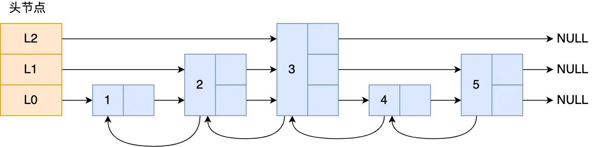

### redis的常用数据类型有哪些？有哪些应用场景？
常用的数据类型有string(字符串)、hash(散列)、list(列表)、set(无序集合)、zset(有序集合)、bitmap(位图｜2.2版新增)、HyperLogLog(2.8版新增)、GEO(3.2版新增)、Stream(5.0版新增)。
- string：缓存对象、常规计数、分布式锁、共享session信息等
- list：缓存对象列表、消息队列
- hash：缓存对象、购物车等
- set：聚合计算，比如点赞、共同关注、抽奖活动等
- zset：排序场景，比如排行榜、电话和排序等
- bitmap：二值状态的统计，比如签到、判断用户登陆状态、连续签到用户总数等
- HyperLogLog：海量数据基数统计的场景，比如百万级网页 UV 计数等
- GEO：存储地理位置信息的场景，比如滴滴叫车
- Stream：消息队列，相比于基于 List 类型实现的消息队列，有这两个特有的特性：自动生成全局唯一消息ID，支持以消费组形式消费数据。

### 了解redis数据结构的实现吗？
#### String类型的实现
String并没有采用C语言的string类型，而是基于SDS实现。SDS由四个字段组成：len(字符串的长度)、alloc(分配的地址空间长度)、flags(sds的数据类型)和buf(字节数组)。
- 这样**获取字符串长度时直接返回成员变量的值即可**，时间复杂度为O(1)。
- 通过alloc记录字符数组的长度，在修改字符串时可以通过`alloc - len`计算出剩余的空间大小，来判断空间是否满足修改需求，如果不满足就会自动将SDS的空间扩展至执行修改所需要的大小，**避免了缓冲区溢出的问题**。
- flags用于标记不同数据类型
- buf用于存放实际数据，不仅可以保存字符串，也可以保存二进制数据。
- SDS不需要用`\0`字符来标识字符串结尾，有个专门的 len 成员变量来记录长度，所以可存储包含`\0`的数据。**保证了二进制数据的安全**。（但为了兼容C语言标准库，SDS还是加上了`'\0'`。）

#### zset类型的实现
zset底层使用了**压缩列表或跳表**实现。如果有序集合的元素个数小于 128 个，并且每个元素的值小于 64 字节时，Redis 会使用**压缩列表**作为Zset 类型的底层数据结构；如果有序集合的元素不满足前面的条件，Redis 会使用跳表作为 Zset 类型的底层数据结构；**在 Redis 7.0 中，压缩列表数据结构已经废弃了，交由 listpack 数据结构来实现了**。当数据量很大时，跳表的查找复杂度就是O(logN)。



跳表是一个带有层级关系的链表，而且每一层级可以包含多个节点，每一个节点通过指针连接起来，实现这一特性就是靠跳表节点结构体中的zskiplistLevel 结构体类型的 level 数组。

```C
typedef struct zskiplistNode {
    //Zset 对象的元素值
    sds ele;
    //元素权重值
    double score;
    //后向指针
    struct zskiplistNode *backward;

    //节点的level数组，保存每层上的前向指针和跨度
    struct zskiplistLevel {
         struct zskiplistNode *forward;
        unsigned long span;
    } level[];
} zskiplistNode;
```

Redis 跳表在创建节点的时候，随机生成每个节点的层数，并没有严格维持相邻两层的节点数量比例为 2 :1 的情况。

具体的做法是，跳表在创建节点时候，会生成范围为`[0-1]`的一个随机数，如果这个随机数小于 0.25（相当于概率 25%），那么层数就增加 1 层，然后继续生成下一个随机数，直到随机数的结果大于 0.25 结束，最终确定该节点的层数。层数越高，概率越低，层高最大限制是 64。**如果层高最大限制是 64，那么在创建跳表「头节点」的时候，就会直接创建 64 层高的头节点。**

> 为什么不使用B+树实现呢？Redis 是内存数据库，跳表在实现简单性、写入性能、内存访问模式等方面的综合优势，使其成为更合适的选择。B+树在插入时可能会出现页分裂的情况，这对于redis来说会降低写操作效率。
Redis作者Antirez曾表示，跳表的实现复杂度远低于平衡树，且性能相近，是更优选择。

### 说一下你对mmap的了解
mmap是内存映射文件(memory mapped files)，它把文件地址映射到进程的地址空间中，使进程可以像操作内存一样操作磁盘文件，而不需要频繁地进行系统调用和数据拷贝，从而提高文件操作效率。


在传统的文件操作中，每次对文件进行读操作时都需要经过`硬盘->内核缓冲区->用户缓冲区`的过程，写操作也需要经历`用户缓冲区->内核缓冲区->硬盘`的过程。而mmap则可以直接将文件映射到进程的地址空间中，可以减少一次`内核缓冲区<->用户缓冲区`的拷贝过程，从而提高文件操作效率。一旦内核将文件映射到内存之后用户进程就可以操作这些数据了，用户进程只需要修改内核当中的内容然后通过内核的内存管理器自动将这些数据刷新到磁盘当中。默认是操作系统自动刷新到磁盘中，但也可以通过`msync()`函数手动进行同步。

### Redis过期策略和淘汰策略
Redis的过期策略和淘汰策略是Redis用来管理内存和存储数据的重要机制。

**过期策略**：
Redis的过期策略主要有两种：惰性删除和定期删除。惰性删除是指在每次访问键时，检查键是否过期，如果过期则删除该键。定期删除则是在一定的时间间隔内随机抽取一部分键进行过期检查，并删除过期的键。

**淘汰策略**：
当Redis的内存使用超过配置的最大值时，Redis会根据配置的淘汰策略来删除一些键，以释放内存。Redis的淘汰策略有以下几种：noeviction（不删除任何键，当内存不足时返回错误）、allkeys-lru（删除最近最少使用的键）、volatile-lru（删除最近最少使用的过期键）、volatile-random（随机删除过期键）、volatile-ttl（删除即将过期的键）。

**延迟释放**：
解决 **“删除键时如何高效释放内存”** 的问题，即当键需要被删除时（无论因过期、淘汰还是主动删除），将内存释放操作交给后台子线程异步执行。lazy-free 特性是 Redis 4.0 开始引入的，指的是让 Redis 采用异步方式延迟释放 key 使用的内存，将该操作交给单独的子线程处理，避免阻塞主线程。