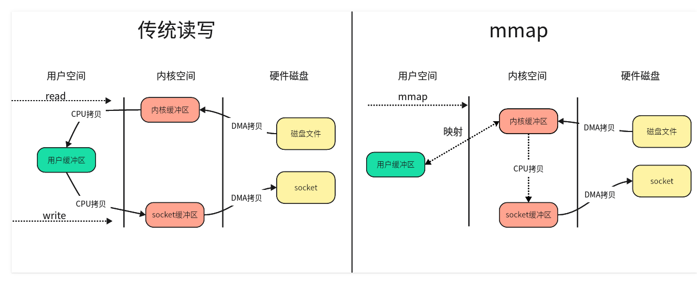

### 说一下你对mmap的了解
mmap是内存映射文件(memory mapped files)，它把文件地址映射到进程的地址空间中，使进程可以像操作内存一样操作磁盘文件，而不需要频繁地进行系统调用和数据拷贝，从而提高文件操作效率。

在传统的文件操作中，每次对文件进行读操作时都需要经过`硬盘->内核缓冲区->用户缓冲区`的过程，写操作也需要经历`用户缓冲区->内核缓冲区->硬盘`的过程。而mmap则可以直接将文件映射到进程的地址空间中，可以减少一次`内核缓冲区<->用户缓冲区`的拷贝过程，从而提高文件操作效率。一旦内核将文件映射到内存之后用户进程就可以操作这些数据了，用户进程只需要修改内核当中的内容然后通过内核的内存管理器自动将这些数据刷新到磁盘当中。默认是操作系统自动刷新到磁盘中，但也可以通过`msync()`函数手动进行同步。