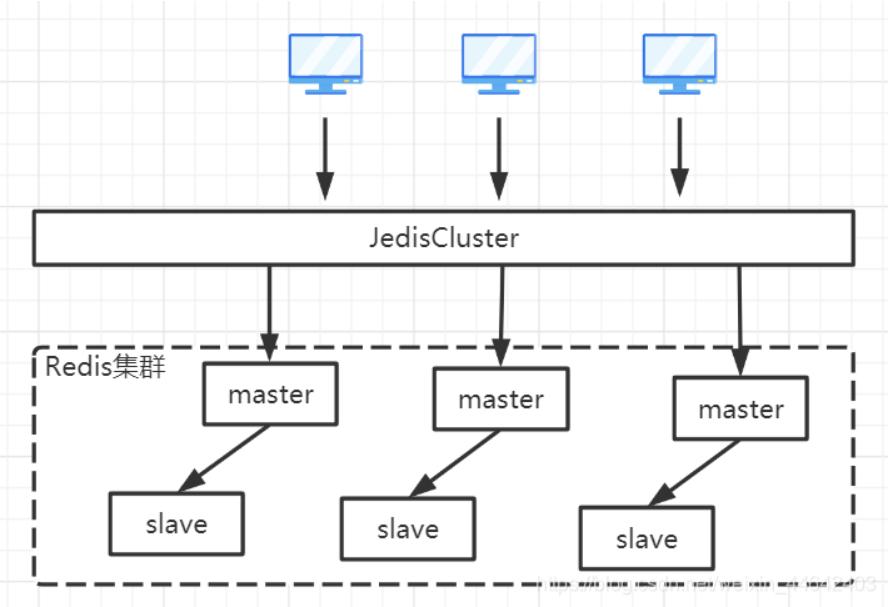
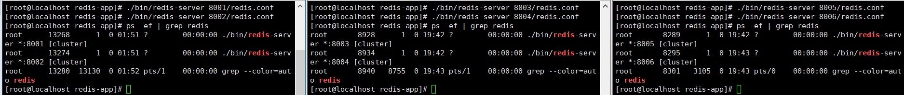

参考链接:[Redis-集群搭建(cluster集群、集群创建、节点配置、节点添加、节点删除、槽位分配)](https://blog.csdn.net/weixin_44642403/article/details/118885921)

### 集群模式搭建

#### 配置文件
我们需要3主3从那边就需要6个Redis服务，首先我们用创建创建好不同端口Redis的文件夹，并且在每一个文件夹里面保存一个redis.conf配置文件

```text
# 修改为后台启动
daemonize yes
# 修改端口号
port 8001
# 指定数据文件存储位置
dir /usr/local/redis-app/8001/
# 开启集群模式
cluster-enabled yes
# 集群节点信息文件配置
cluster-config-file nodes-8001.conf
# 集群节点超时间
cluster-node-timeout 15000
# 去掉bind绑定地址
# bind 127.0.0.1 -::1 (这里没写错就是家#注释掉bind配置)
# 关闭保护模式
protected-mode no
# 开启aof模式持久化
appendonly yes
# 设置连接Redis需要密码123（选配）
requirepass 123456
# 设置Redis节点与节点之间访问需要密码123（选配）
masterauth 123456
```
#### 启动Redis服务
修改完毕后，逐个启动Reids服务，启动成功后我们可以从ps -ef中看到启动的Redis进程于普通的Redis进程不同之处在于后面的`[cluster]`表示当前进程是集群模式启动的
```bash
./bin/redis-server /path/to/redis-6382.conf
```


#### 集群创建
在任意一台机器上执行如下命令，即可创建集群，执行如下命令后Redis会随机分配主从机器，并且在分配的时Redis是不会让主节点与从节点在同一台机器上的
```bash
# -a 密码认证，若没写密码无效带这个参数
# --cluster create 创建集群实例列表 IP:PORT IP:PORT IP:PORT
# --cluster-replicas 复制因子1（即每个主节点需1个从节点）
./bin/redis-cli -a 123456 --cluster create --cluster-replicas 1 192.168.100.101:8001 192.168.100.101:8002 192.168.100.102:8003 192.168.100.102:8004 192.168.100.103:8005 192.168.100.103:8006
```
执行命令后会让你确认配置，输入yes确认
### 验证集群
#### 登录集群
```bash
# -a 密码认证
# -c 连接集群
# -h 集群中任意一个Redis节点IP
# -p 集群中任意一个Redis节点端口
./bin/redis-cli -a 123456 -c -h 192.168.100.101 -p 8001
```
#### 查看集群信息
```bash
# -a 密码认证
# -c 连接集群
# -h 集群中任意一个Redis节点IP
# -p 集群中任意一个Redis节点端口
./bin/redis-cli -a 123456 -c -h 192.168.100.101 -p 8001 cluster info
```
#### 查看集群节点信息
```bash
# -a 密码认证
# -c 连接集群
# -h 集群中任意一个Redis节点IP
# -p 集群中任意一个Redis节点端口
./bin/redis-cli -a 123456 -c -h 192.168.100.101 -p 8001 cluster nodes
```
### 添加主节点
#### 添加节点
我们对当前的3主3从进行扩容成4主4从，首先在准备多一台Liunx，并且在上面安装好Redis配置好2个Redis服务的配置文件，并且启动2个服务
```bash
# -a 密码认证(没有密码不用带此参数)
# --cluster add-node 添加节点 新节点IP:新节点端口 任意存活节点IP:任意存活节点端口
./bin/redis-cli -a 123456 --cluster add-node 192.168.100.104:8007 192.168.100.101:8001
```
使用cluster nodes命令查看集群信息表，可以看到8007已经被添加到了新的集群中了，但是8007并且没有任何的槽位信息，这时就需要迁移槽位。
#### 迁移槽位
```bash
# -a 密码认证
# --cluster reshard 任意存活节点IP:任意存活节点端口
./bin/redis-cli -a 123456 --cluster reshard 192.168.100.101:8001
```
输入完成后会打印一片执行计划给你看，输入yes就会把槽位与数据全部迁移到新节点了。迁移完毕后再查看集群信息可以看到8007已经添加了槽位了

### 从节点添加
#### 添加从节点
```bash
# 使用如下命令即可添加节点将一个新的节点添加到集群中
# -a 密码认证(没有密码不用带此参数)
# --cluster add-node 添加节点 新节点IP:新节点端口 任意存活节点IP:任意存活节点端口
./bin/redis-cli -a 123456 --cluster add-node 192.168.100.104:8008 192.168.100.101:8001
```
通过节点信息可以查看到8008节点已经添加进去了，但是任何的节点添加都是主节点，那么接下来我们需要把8008改成从节点。我们需要使用客户端命令连接到刚刚新添加的8008节点的上，并且为他设置一个主节点，设置完毕后再次查看节点信息，可以看到8008已经是8007的从节点了
```bash
# 连接需设为从节点的Redis服务
./bin/redis-cli -a 123456 -p 8008
# 将当前节点分配为 8cf44439390dc9412813ad27c43858a6bb53365c 的从节点
CLUSTER REPLICATE 8cf44439390dc9412813ad27c43858a6bb53365c
```