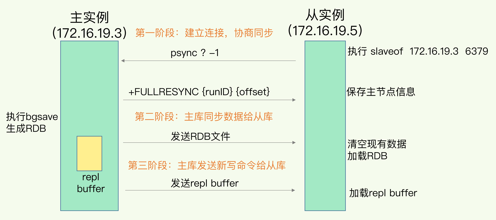
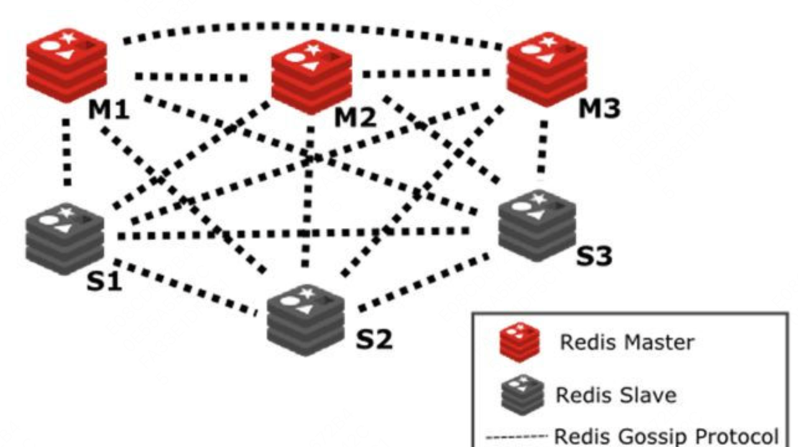

### 主从复制了解吗？
主从复制允许从节点维护主节点的数据副本。在这种架构中，一个主节点可以连接多个从节点，从而形成一主多从的结构。主节点负责处理写操作，从节点自动同步主节点的数据变更，并处理读请求，**从而实现读写分离，减轻主节点压力的同时提高系统的并发能力**。此外，从节点可以作为主节点的数据备份，当主节点发生故障时，**可以快速将从节点提升为新的主节点，从而保证系统的高可用性**。

主从复制有全量同步和增量同步两种。全量同步会将主节点的完整数据集传输给从节点，通常发生在从节点首次连接主节点时。增量同步允许从服务器从断点处继续同步，而不是每次都进行完全同步。

### 主从复制的原理了解吗？
主从复制的过程大致可以分为三个阶段：建立连接、同步数据和传播命令。



全量同步的过程大致如下：
- 在建立连接阶段，从节点通过执行replicaof命令连接到主节点。连接建立后，从节点向主节点发送`psync {runId} {offset}`命令，请求数据同步。如果从节点会发送`psync ? -1`或者主从节点各自的`{offset}`差距太大，则进行全量同步。
- 主节点为从节点创建一个连接和复制缓冲区。然后主节点会fork一个子进程生成RDB文件发送给从节点。
- 从节点收到RBD后会清空当前的数据库，然后载入RDB文件中的数据。
- 在RDB文件生成和传输期间，主服务器会记录所有接收到的写命令到复制积压缓冲区。
- 在RDB文件生成和传输期间，主服务器会记录所有接收到的写命令到从服务器，从服务器会执行这些命令，以保证数据的一致性。（增量同步）

全量同步的代价很高，因为完整的 RDB 文件在生成时会占用大量的 CPU 和磁盘 IO；在网络传输时还会消耗掉不少带宽。全量同步发生在以下几种情况：
- 初次同步：当一个从服务器（slave）首次连接到主服务器（master）时，会进行一次全量同步。
- 从服务器数据丢失：如果从服务器数据由于某种原因（如断电）丢失，它会请求进行全量同步。
- 主服务器数据发生变化：如果从服务器长时间未与主服务器同步，导致数据差异太大，也可能触发全量同步。

增量同步允许从服务器从断点处继续同步，而不是每次都进行完全同步。它基于PSYNC命令，使用了运行ID（run ID）和复制偏移量（offset）的概念。当从节点与主节点断开重连后，会发送 `psync{runId}{offset}` 命令，带上之前记录的主节点 ID 和复制偏移量。主节点根据复制积压缓冲区(repl_backlog_buffer)和复制偏移值(replication_offset)进行增量同步。

- 每个主节点都有一个唯一 ID，即复制 ID，用于标识主节点的数据版本。当主节点发生重启或者角色变化时，ID 会改变。
- 复制积压缓冲区是一个「环形」缓冲区，用于主从服务器断连后，从中找到差异的数据；
- 复制偏移值标记上面那个缓冲区的同步进度，主从服务器都有各自的偏移量，主服务器使用 master_repl_offset 来记录自己「写」到的位置，从服务器使用 slave_repl_offset 来记录自己「读」到的位置。

在主服务器进行命令传播时，不仅会将写命令发送给从服务器，还会将写命令写入到repl_backlog_buffer 缓冲区里，因此这个缓冲区里会保存着最近传播的写命令。网络断开后，当从服务器重新连上主服务器时，从服务器会通过 psync 命令将自己的复制偏移量slave_repl_offset 发送给主服务器，主服务器根据自己的 runId和offset来决定对从服务器执行哪种同步操作：
- 如果主节点 ID 与从节点提供的 runId 不匹配，说明主节点已经变化，必须进行全量同步
- 如果 ID 匹配并且判断出从服务器要读取的数据还在 repl_backlog_buffer 缓冲区里，那么主服务器将采用增量同步的方式；
- 如果 ID 匹配并且判断出从服务器要读取的数据已经不存在 repl_backlog_buffer 缓冲区里，那么主服务器将采用全量同步的方式。

所以，为了避免在网络恢复时，主服务器频繁地使用全量同步的方式，我们应该调整下repl_backlog_buffer 缓冲区大小，尽可能的大一些，减少出现从服务器要读取的数据被覆盖的概率，从而使得主服务器采用增量同步的方式。
```bash
repl-backlog-size 1mb  # 默认值 1MB，表示主节点的复制缓冲区大小
repl-backlog-ttl 3600  # 默认值 3600 秒，表示主节点的复制缓冲区存活时间
```

### 主从复制的数据一致性问题了解吗？
由于网络通信等总总因素，主从数据库可能会出现数据不一致的情况。主要有以下原因：
- 主节点写入数据后宕机，但从节点没来得及复制。
- 当主节点内存接近上限并启用了淘汰策略时，某些键可能被自动删除，而这些删除操作如果未能及时同步
- 集群出现分区导致脑裂，从而导致不同分区数据不一致。并且于是原主节点会自动降级为从节点。在降级过程中，它需要与新主节点进行全量同步，此时原主节点的数据会被清空。导致客户端在原主节点故障期间写入的数据全部丢失。

为了解决数据不一致，一般有下面三种方法。
- 理想情况下，主从节点应该部署在同一个网络区域内，避免跨区域的网络延迟。
- 其次是配置层面的调整，比如说适当增大复制积压缓冲区的大小和存活时间，以便从节点重连后进行增量同步而不是全量同步，以最大程度减少主从同步的延迟。
- 引入监控和自动修复机制，定期检查主从节点的数据一致性。通过比较主从的 offset 差值判断从库是否落后。一旦超过设定阈值，就将从节点剔除，并重新进行全量同步。
- 如果是脑裂，会导致旧的master写入的数据无法同步到新的master。为了防止这种数据丢失，Redis 提供了 min-slaves-to-write 和 min-slaves-max-lag 参数。这两个参数可以设置最少需要多少个从节点在线，以及从节点的最大延迟时间。由于主节点无法再连接到任何从节点，或者延迟超过了设定值，主节点就会自动拒绝所有写请求。
```bash
# 设置主节点能进行数据同步的最少从节点数量
min-slaves-to-write 1
# 设置主从节点间进行数据同步时，从节点给主节点发送 ACK 消息的最大延迟（以秒为单位）
min-slaves-max-lag 10
```
### Redis哨兵模式了解吗？
在 Redis 的主从架构中，由于主从模式是读写分离的，如果主节点（master）挂了，那么将没有主节点来服务客户端的写操作请求，也没有主节点给从节点（slave）进行数据同步了。这时如果要恢复服务的话，需要人工介入，选择一个「从节点」切换为「主节点」，然后让其他从节点指向新的主节点，同时还需要通知上游那些连接 Redis 主节点的客户端，将其配置中的主节点 IP 地址更新为「新主节点」的 IP 地址。

Redis 中的哨兵用于监控主从集群的运行状态，并在主节点故障时自动进行故障转移。哨兵其实是一个运行在特殊模式下的 Redis 进程，所以它也是一个节点。哨兵节点主要负责三件事情：定时监控、主客观下线、领导者选举和故障转移。
- 首先，哨兵会定期向所有 Redis 节点发送 PING 命令来检测它们是否可达。如果在指定时间内没有收到回复，哨兵会将该节点标记为“主观下线”。
- 当一个哨兵判断主节点主观下线后，会询问其他哨兵的意见，如果达到配置的法定人数(quorum)，主节点会被标记为“客观下线”。
- 然后开始故障转移，这个过程中，哨兵会先选举出一个领导者，领导者再从从节点中选择一个最适合的节点作为新的主节点，选择标准包括复制偏移量、优先级等因素。
- 确定新主节点后，哨兵会向其发送 `SLAVEOF NO ONE` 命令使其升级为主节点，然后向其他从节点发送 `SLAVEOF` 命令指向新主节点，最后通过发布/订阅机制通知客户端主节点已经发生变化。

在实际部署中，为了保证哨兵机制的可靠性，通常建议至少部署三个哨兵节点，并且这些节点应分布在不同的物理机器上，降低单点故障风险。同时，法定人数的设置也非常关键，一般建议设置为哨兵数量的一半加一，既能确保在少数哨兵故障时系统仍能正常工作，又能避免网络分区导致的脑裂问题。

quorum 是在 sentinel.conf中手动配置的，默认为2，意味着只有大于等于quorum数量的sentinel都认为master主观下线，sentinel集群才会认为master客观下线。

### 哨兵选举的原理了解吗？
Redis 使用 Raft 算法实现领导者选举，目的是在主节点故障时，选出一个哨兵来负责执行故障转移操作。每一个Sentinel节点都可以成为Leader。
- 当一个Sentinel节点确认redis集群的主节点主观下线后，会请求其他Sentinel节点要求将自己选举为Leader。
- 收到请求的哨兵节点进行判断，如果候选者的日志和自己的一样新，任期号也小于自己，且之前没有投票过，就会投同意票 Y。否则回复 N。
- 如果一个Sentinel节点获得的选举票数达到Leader最低票数(max(quorum,num(sentinels)/2+1))，则该Sentinel节点选举为Leader；否则重新进行选举。
- 为了防止无限制的选举失败，每个哨兵都会有一个选举超时时间，且是随机的。每个哨兵会在 0-2 秒的随机时间后开始选举，减少选举冲突。

### 如何选取新的主节点？
- 首先，Leader会对所有从节点进行一轮基础筛选，排除那些不满足基本条件的节点。比如说已下线的节点、网络连接不稳定的节点，以及优先级设为 0 明确不参与挑选的节点。
- 根据从节点优先级、复制偏移量和运行ID进行排序选出最优节点。
  - 从节点优先级：slave-priority 的值越小优先级越高，优先级为0的从节点不会被选中。
  - 复制偏移量：偏移量越大意味着从节点的数据越新，复制的越完整。
  - 运行ID：如果优先级和偏移量都相同，就比较运行ID的字典序，字典序小的优先。
- 选出新主节点后，哨兵会向其发送 SLAVEOF NO ONE 命令将其提升为主节点。
- 之后，Leader会等待新主节点的角色转换完成，通过发送 INFO 命令检查其角色是否已变为 master 来确认。确认成功后，会更新所有从节点的复制目标，指向新的主节点。

### 了解redis集群模式吗？
Redis Cluster 是 Redis 官方提供的一种分布式集群解决方案。其核心理念是去中心化，为了保证集群的高可用，采用 P2P 模式，没有中心节点的概念。每个节点都保存着数据和整个集群的状态，节点之间通过 gossip 协议交换信息。



Redis Cluster 方案采用哈希槽（Hash Slot），来处理数据和节点之间的映射关系。在 Redis Cluster 方案中，一个切片集群共有 16384 个哈希槽，这些哈希槽类似于数据分区，每个键值对都会根据它的 key，被映射到一个哈希槽中，具体执行过程分为两大步：
- 根据键值对的 key，按照 CRC16 算法计算一个 16 bit 的值。
- 按照 CRC16 算法计算一个 16 bit 的值。得到 0~16383 范围内的模数，每个模数代表一个相应编号的哈希槽。


哈希槽怎么被映射到具体的 Redis 节点上的呢?[如何搭建redis集群环境](./Redis集群搭建.md)
- 平均分配：每个节点通过设置 `cluster-enabled yes` 来开启集群模式。`在使用 cluster create` 命令创建 Redis 集群时，Redis 会自动把所有哈希槽平均分布到集群节点上。比如集群中有4个节点，则每个节点上槽的个数为 16384/4个。
- 手动分配：可以使用 `cluster meet `命令手动建立节点间的连接，组成集群，再使用 `cluster addslots` 命令，指定每个节点上的哈希槽个数。
- 迁移分配：当集群需要扩容或缩容时，Redis 提供了 `cluster reshard` 命令，可以重新分配哈希槽。

Redis Cluster 方案中，节点之间通过 Gossip 协议进行通信。Gossip 协议是一种去中心化的通信协议，用于节点之间信息的传播和同步。每个节点都会周期性地向其他节点发送消息，消息内容包括节点的状态、哈希槽的分配情况等。通过这种方式，集群中的节点可以实时了解其他节点的状态，从而保持集群状态的最终一致性。

采用了 Gossip 协议，我们不需要让每对节点都执行握手。在一个多节点集群的部署中，仅需要让第一个节点与其他节点握手，其余节点就能通过信息传播自动发现并连接彼此。
